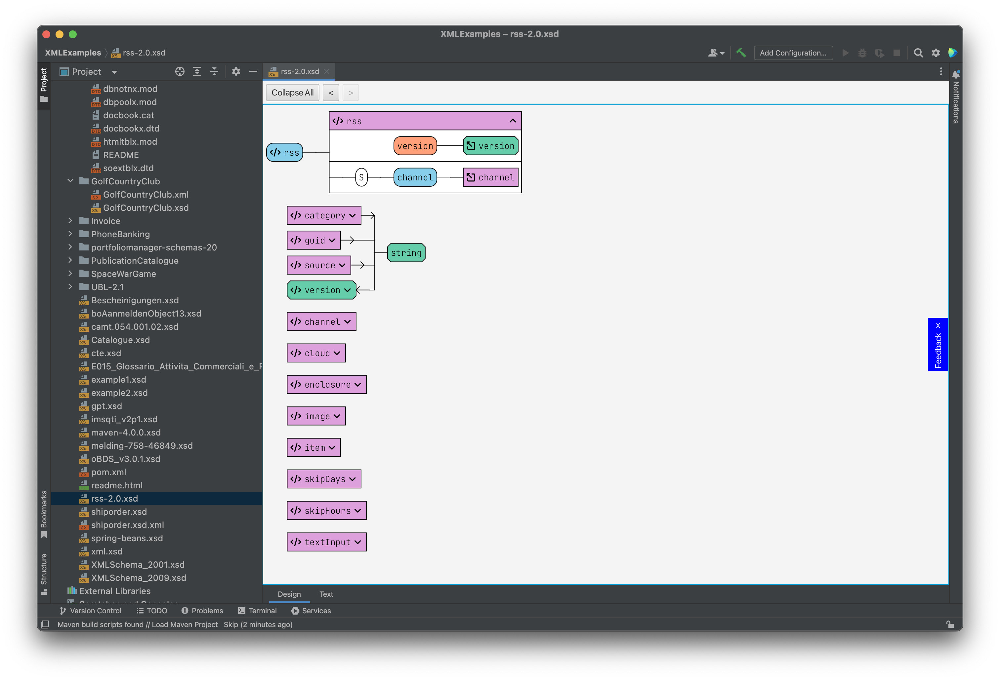
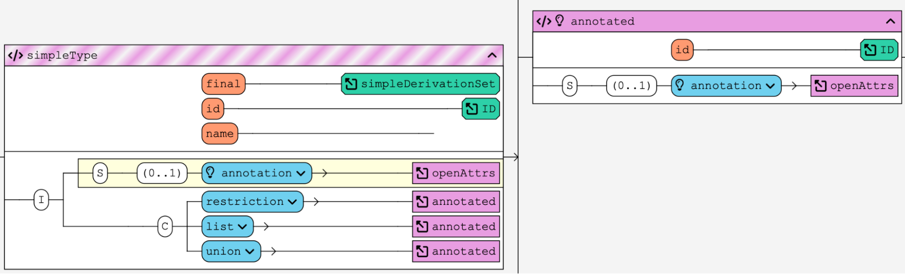
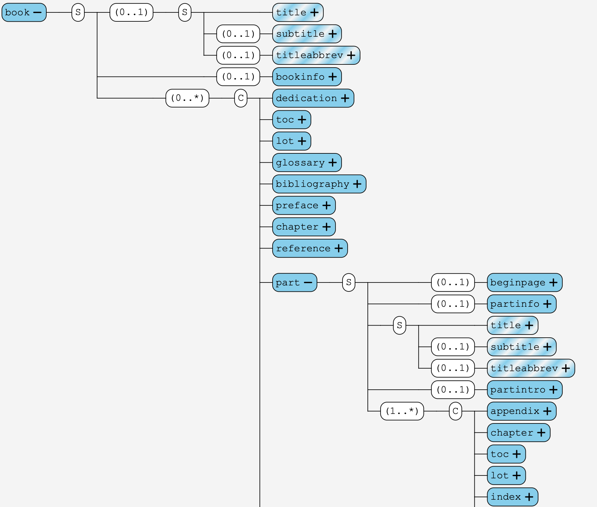
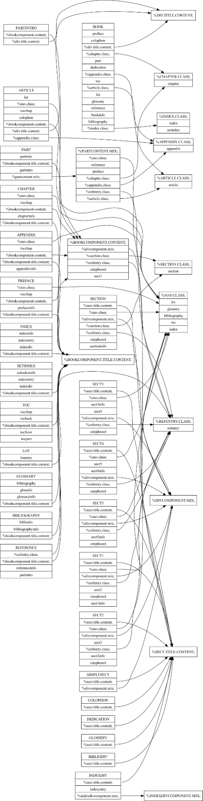

# Introduction

Schema development and processing play a pivotal role in ensuring the
quality and integrity of structured data. However, several challenges
arise in this process, hindering the effective management and
optimization of schemas. This paper aims to address these challenges by
introducing the \"XSD Visualizer Plugin\", a comprehensive tool designed
to enhance schema quality assurance.

First, it is important to understand that the use of XML can be divided
into two different fields of use that make different requirements of XML
schemas and pose distinct challenges for the quality. XML-based data and
XML-based document formats both provide structured representation and
interoperability, but are completely different in the features they
demand from a schema.

On the one hand, XML-based data formats present their own set of
challenges. As data formats evolve and requirements change, modifying
elements within a hierarchy can be a challenge. A minor misstep can have
a cascading effect on the entire data structure.

On the other hand, for XML-based document formats, one of the primary
challenges lies in understanding the schema as a whole. XML schemas
provide a blueprint for defining the structure, data types, and
relationships within a document. Navigating and comprehending complex
schemas can be a daunting task, often leading to errors and
inconsistencies during the document creation and validation process.

One of the primary challenges faced by developers and users is
comprehending the schema as a whole. Schemas often comprise complex
hierarchies of elements, making it difficult to gain a clear and
holistic understanding of their structure. This lack of comprehensive
understanding can impede effective schema modification, validation, and
overall maintenance.

To tackle these challenges, the \"XSD Visualizer Plugin\" offers a
solution that is more intuitive and seamless than traditional schema
visualization tools. By providing an intuitive and interactive visual
representation of the schema, the plugin enables users to comprehend the
schema as a cohesive whole. Users can explore the hierarchy, navigate
through elements, and gain a holistic understanding of the schema\'s
structure, promoting better decision-making and efficient modification.

Additionally, the \"XSD Visualizer Plugin\" shows the effective
structure of elements while preserving the information how it was
created, allowing users to modify elements within the hierarchy and
maintaining schema correctness. This feature makes it easier to change
the schema without creating collateral damage and compromising the
overall quality of the schema.

However, the \"XSD Visualizer Plugin\" is designed with a focus on
schemas intended for XML-based data formats. But by providing tailored
visualization for other use cases, the plugin enables users to ensure
the quality not only for XML-based data formats but for XML-based
document formats as well.

In the subsequent sections of this paper, we will delve deeper into the
key features and functionalities of the \"XSD Visualizer Plugin\",
illustrating how it addresses these challenges and improves schema
quality assurance.

Through the integration of the \"XSD Visualizer Plugin\" into the schema
development workflow, users can significantly enhance the quality, and
maintainability of their schemas.

# Background and Related Work

In the realm of XML schema visualization and editing, several existing
tools have aimed to provide support for navigating and understanding
complex schemas. Oxygen XML Editor, XmlSpy, and Liquid XML Studio are
among the notable tools in this domain. While these tools have made
significant contributions, over time they have gained so much complexity
that they can be quite intimidating on first use and due to the density
of features the main purpose of a visualizer software - giving a clear
overview - gets lost.

Here is a screenshot of XMLSpy, for example. When opening the RSS format
XML schema. While the visualization of the schema is a good start, there
is a lot going on around it that can be quite intimidating and let\'s
the user question where to go next.

In the next screenshot the channel element is open but because of the
annotations the graphic gets so big that it cannot be shown entirely on
the screen. While there is an option to hide the annotations, this is
the default behavior and the user has to search for the option to make
the visualization more readable.

By focusing on visualization - for the cost of editing features at this
moment - the \"XSD Visualizer Plugin\" aims to provide a solution that
mitigates the steep learning curve often associated with these
traditional schema visualization tools. Recognizing the importance of a
user-friendly and intuitive experience, the \"XSD Visualizer Plugin\"
prioritizes simplicity and ease of use.

Here are the same screenshots as before with the \"XSD Visualizer
Plugin\":

The interface is much cleaner. Mostly because it\'s the UI of IntelliJ.
But the plugin focuses mainly on the visualization.

The channel type has an arrow in front of it. When clicked, it doesn\'t
open like in XMLSpy but instead moves the further down the already
visible channel type and opens it. The complete type fits on the screen
because the annotations are only shown as a tooltip when the user hovers
the mouse cursor over the name. The presence of an annotation is shown
by the light bulb.

By streamlining the user interface and intuitive interaction design, the
\"XSD Visualizer Plugin\" enables users, including beginners, to quickly
grasp the functionalities and harness the power of schema visualization.
The visual representation of the schema\'s inheritance hierarchy,
coupled with a seamless navigation experience, empowers users to
understand the schema as a cohesive whole without struggling through
complex learning curves.

# Introducing the XSD Visualizer Plugin

The \"XSD Visualizer Plugin\" is a powerful tool designed to enhance the
schema visualization experience within the IntelliJ IDE. Initially
focused on XML Schema (XSD) support, the plugin aims to provide
developers and designers with an intuitive and efficient means of
understanding, navigating, and modifying XML schemas directly within
their IntelliJ environment. While its current scope is limited to
IntelliJ and XML Schema, future developments will be explored and
discussed in a subsequent section.

By seamlessly integrating with IntelliJ, a popular and widely-used IDE
among developers, the \"XSD Visualizer Plugin\" brings schema
visualization capabilities directly to the workflow of XML schema
designers, simplifying their tasks and promoting a more efficient
development process. With the plugin, users can seamlessly work with XML
schemas without the need to switch between different tools or
environments, streamlining their workflow and saving valuable time and
effort.

The \"XSD Visualizer Plugin\" offers a comprehensive set of features
tailored specifically for XML Schema visualization. Its core
functionality lies in providing a visual representation of the schema\'s
inheritance hierarchy and the actual structure of elements, considering
all the parent types and their relationships. This visual representation
provides users with a clear overview of the schema\'s structure,
allowing them to comprehend its complexities and dependencies at a
glance.

Furthermore, the plugin incorporates intuitive navigation controls,
enabling users to easily explore different sections of the schema,
unfold elements for a more detailed view, and navigate between related
elements and their relationships. This smooth and seamless navigation
experience enhances the overall understanding and comprehension of the
schema, making it easier for developers to work with and modify the
schema as needed.

# Key Features for Assessing Schema Quality

The \"XSD Visualizer Plugin\" goes beyond traditional schema
visualization tools by offering a range of advanced features that
contribute to improving the quality and understanding of XML schemas.
These features provide valuable insights into the inheritance structure,
effective element and type structure, and enable editing through the
Jump-to-Code functionality. While certain features are still in
development, they will be discussed in detail in a dedicated section.

## Visualizing Inheritance Structure

One of the key features of the \"XSD Visualizer Plugin\" is its ability
to visually represent the inheritance structure of XML schemas. By
analyzing the schema\'s hierarchy and considering all parent types, the
plugin generates a clear and comprehensive visualization that highlights
the relationships and dependencies between elements and types. This
visualization allows users to understand the inheritance chain,
facilitating the identification of potential issues or conflicts within
the schema\'s structure.

## Providing Effective Element and Type Structure

The plugin not only displays the inheritance structure but also provides
an effective view of the element and type structure within the schema.
It presents the actual structure of elements, taking into account the
contributions from all parent types. This ensures that users have a
complete understanding of how elements are defined and organized,
enabling them to make informed decisions when working with complex
schemas.

## Jump-to-Code for Seamless Editing

The \"XSD Visualizer Plugin\" introduces a Jump-to-Code feature, which
allows users to navigate directly to the code corresponding to a
specific element or type within the schema. This functionality enables
seamless editing and modification, even in situations where the full
editing features are still in development. Users can conveniently locate
the code associated with a particular element, make necessary changes,
and observe the immediate impact on the visual representation of the
schema.

## Future Development

While the aforementioned features contribute significantly to improving
schema quality, it is important to note that the \"XSD Visualizer
Plugin\" is an evolving tool. The development team is actively working
on additional features and enhancements to further enhance schema
quality assurance. These forthcoming features will be explored in depth
in a subsequent section, providing insights into the future roadmap and
the potential benefits they bring to schema designers and developers.

# Enhancing the Schema Quality Workflow with Work-in-Progress Features

The \"XSD Visualizer Plugin\" is continuously evolving to provide a
comprehensive suite of features that enhance the workflow for ensuring
schema quality. In addition to the existing capabilities, the plugin is
currently under development with two exciting features aimed at
improving the understanding and composition of XML-based document
formats: the TreeView and the Composite View.

## Tree View for Exploring the Actual Structure

The Tree View feature is being developed to enable users to explore the
actual structure of an XML file in alignment with an associated XML
Schema Definition (XSD) or Document Type Definition (DTD). This feature
provides a visual representation of the hierarchical structure of the
XML format, showcasing the relationships between elements, attributes,
and their respective values. By visualizing the possible structure of
the XML file alongside the XML file, users can easily identify any
discrepancies or inconsistencies between the file and its associated
schema, ensuring adherence to the defined structure.

This is a screenshot of the DocBook structure. It is easy to see which
elements are optional \"0..1\" and which are choices \"C\". The \"S\"
means sequence, so in this case \"title\", \"subtitle\" and
\"titleabbrev\" have to be at the top of the \"book\" element and in
this order. The half filled boxes mean that these elements allow text
directly in them.

A click on the plus sign reveals what child elements can appear inside
this element.

## Composite View for Understanding Complex Composition Structures

The Composite View is another work-in-progress feature that aims to
facilitate a deeper understanding of the complex composition structures
present in XML-based document formats. Many XML document formats, such
as DocBook, involve intricate relationships and dependencies between
various components. The Composite View will provide a visual
representation of these composition structures, showcasing the
interconnections, dependencies, and hierarchy of components within the
XML-based document format. This feature will aid users in comprehending
the complex relationships between different parts of the document,
thereby improving their ability to design, validate, and maintain
high-quality schemas for such formats.

Since DocBook 4.5 is an XML-based document format that is described as
DTD - a format that is better for data formats - the structure can be
quite complicated. This is an idea on how to visualize the composition
of these groups so the authors of this format have a better
understanding of their format. I assume it can be pretty hard to keep
such a structure in your head. Maybe this visualization can even help to
clean up the format.

These work-in-progress features demonstrate the ongoing commitment of
the \"XSD Visualizer Plugin\" team to enhance the schema quality
workflow. By introducing the TreeView and Composite View, the plugin
aims to provide users with powerful tools to explore and understand the
actual structure of XML files, ensuring alignment with the associated
schema and enabling efficient handling of complex composition
structures.

# Implementation Details of the XSD Visualizer Plugin

The \"XSD Visualizer Plugin\" is implemented using a combination of Java
and Kotlin programming languages, leveraging the JavaFX framework for
its user interface (UI) components. However, due to the underlying
Swing-based UI framework used by IntelliJ, the plugin incorporates a
compatibility layer to ensure seamless integration within the IntelliJ
environment. Nevertheless, the plugin is designed in such a way that
future porting to Swing can be achieved with minimal effort, allowing
for the removal of the compatibility layer.

The foundation of the \"XSD Visualizer Plugin\" is built upon Javis
(Java Visualizer), a tool developed by the author for visualizing the
execution of Java programs during training sessions. By leveraging the
capabilities and insights gained from Javis, the plugin offers a robust
and feature-rich visualization experience for XML schemas within the
IntelliJ IDE.

To enable fluid and dynamic changes to the UI during the exploration and
editing of schemas, the XSD Visualizer Plugin utilizes the Fenja
library, developed by the author. Fenja provides a set of powerful tools
and utilities specifically designed to facilitate a seamless and
interactive user experience when working with dynamic UI elements. This
library allows users to navigate, explore, and modify the schema in a
fluid manner, ensuring a smooth and efficient workflow.

# Feedback and Future Development

\[Link zur Umfrage mit Tracking. Tracking-Link auch auf der Homepage \]

The \"XSD Visualizer Plugin\" has received valuable feedback from users
and the development team remains committed to further improving and
expanding its capabilities. In response to user needs and emerging
industry trends, the following future developments and enhancements are
planned:

## Support for Additional Schema Formats

Recognizing the diverse landscape of schema languages, the \"XSD
Visualizer Plugin\" aims to broaden its support beyond XML Schema. The
development team is actively working on incorporating support for other
popular schema formats such as Schematron and Relax NG. Even JSON Schema
is on the roadmap. This expansion will enable users to visualize and
analyze schemas written in these languages, enhancing the overall
versatility and usefulness of the plugin.

## Potential Name Change to \"SchemaViz\"

As the \"XSD Visualizer Plugin\" evolves to support various schema
formats, the plugin\'s name will probably transition to \"SchemaViz.\"
This name change would reflect its expanded scope and emphasize its
applicability to a wider range of schema languages. The new name will
align with the plugin\'s goal of providing comprehensive schema
visualization capabilities, regardless of the underlying schema format.

## Port to Visual Studio Code

In recognition of the popularity and widespread adoption of Visual
Studio Code as a versatile and powerful code editor, the development
team is actively pursuing a port of the \"XSD Visualizer Plugin\" to
this platform. Leveraging the implementation in Kotlin, which can be
compiled to JavaScript, the team is in the late stages of development
for a Visual Studio Code version of the plugin. This will extend the
reach of the plugin to a broader audience and provide seamless schema
visualization within the Visual Studio Code environment.

## HTML Export with SVG Graphics

To facilitate sharing and collaboration, the \"XSD Visualizer Plugin\"
is introducing an HTML export feature. Users will be able to export
parts of their schemas as HTML files, accompanied by SVG graphics that
capture the visual representation of the schema. This export capability
will enable users to generate visually appealing non-interactive
representations of their schemas, which can be easily shared, viewed,
and analyzed in web browsers or other compatible platforms.

# Conclusion

In conclusion, the \"XSD Visualizer Plugin\" offers a powerful and
intuitive solution for enhancing schema quality assurance and
visualization within the IntelliJ IDE. By addressing the challenges
associated with understanding and modifying XML-based document and data
formats, the plugin provides users with a comprehensive set of features
that promote efficient and effective schema design, validation, and
maintenance.

Through its innovative visualizations, including the visualization of
inheritance structures and effective element and type representations,
the \"XSD Visualizer Plugin\" enables users to gain deep insights into
their schemas. The clear and intuitive interface empowers users to
identify and address quality issues, ensuring adherence to defined
structures and promoting best practices in markup design.

The plugin\'s work-in-progress features, such as the Tree View for
exploring the actual structure of XML files and the Composite View for
understanding complex composition structures, further enhance the schema
quality workflow. These features facilitate a holistic view of schemas,
enabling users to navigate and analyze their structures with ease.

Looking ahead, the \"XSD Visualizer Plugin\" has ambitious plans for
future development. The team is actively working on expanding support
for other schema formats, such as Schematron, Relax NG and even JSON
Schema, to cater to a broader range of user needs.

The plugin\'s portability to Visual Studio Code and the introduction of
an HTML export feature with SVG graphics further emphasize its
commitment to facilitating collaboration and sharing within the schema
design community.

Overall, the XSD Visualizer Plugin provides a seamless and user-friendly
experience for schema designers, developers, and stakeholders. It
empowers users to navigate, explore, and validate their schemas with
confidence, ultimately contributing to improved quality and efficiency
in markup design.
